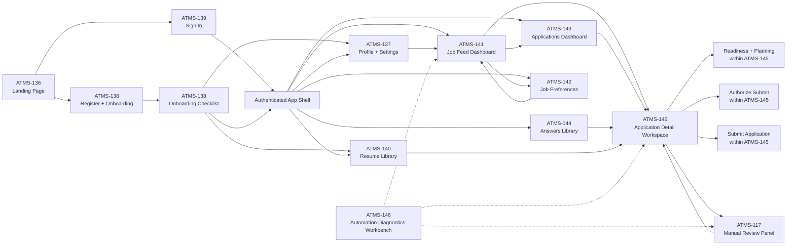

# Artemis Frontend Page Map

This document captures the current frontend information architecture derived from the ATMS-56 API/UI audit and the resulting Jira design tickets.

## Tickets Covered

- `ATMS-136` Landing page
- `ATMS-137` Candidate profile and account settings
- `ATMS-138` Registration and onboarding
- `ATMS-139` Sign in
- `ATMS-140` Resume library and upload management
- `ATMS-141` Job feed dashboard
- `ATMS-142` Job preferences and targeting settings
- `ATMS-143` Applications dashboard
- `ATMS-144` Reusable application answers library
- `ATMS-145` Application detail workspace
- `ATMS-146` Internal automation diagnostics workbench
- `ATMS-117` Manual fill review panel

## Mermaid Page Map

## Navigation Summary

### Public Entry

- `ATMS-136` -> `ATMS-139`
- `ATMS-136` -> `ATMS-138`

### Onboarding and Setup

- `ATMS-138` -> `ATMS-137`
- `ATMS-138` -> `ATMS-140`
- `ATMS-138` -> authenticated app shell

### Authenticated App Shell

- app shell -> `ATMS-141`
- app shell -> `ATMS-143`
- app shell -> `ATMS-144`
- app shell -> `ATMS-137`
- app shell -> `ATMS-140`
- app shell -> `ATMS-142`

### Main Product Flows

- `ATMS-141` -> `ATMS-142`
- `ATMS-141` -> `ATMS-143`
- `ATMS-141` -> `ATMS-145`
- `ATMS-143` -> `ATMS-145`
- `ATMS-144` -> `ATMS-145`
- `ATMS-140` -> `ATMS-145`
- `ATMS-137` -> `ATMS-141`
- `ATMS-142` -> `ATMS-141`

### Application Detail Subflows

- `ATMS-145` contains readiness, planning, automation run, authorization, and submit controls.
- `ATMS-145` can escalate to `ATMS-117` when unresolved fields require manual intervention.
- `ATMS-117` returns the user back to `ATMS-145` after review.

### Internal-Only Tooling

- `ATMS-146` is not part of the normal candidate navigation.
- `ATMS-146` exists to support internal debugging and QA around `ATMS-145`, `ATMS-117`, and related automation flows.

## Suggested IA Grouping

- Public entry: `ATMS-136`, `ATMS-138`, `ATMS-139`
- Setup/account: `ATMS-137`, `ATMS-140`
- Discovery: `ATMS-141`, `ATMS-142`
- Application workflow: `ATMS-143`, `ATMS-145`, `ATMS-144`, `ATMS-117`
- Internal tools: `ATMS-146`