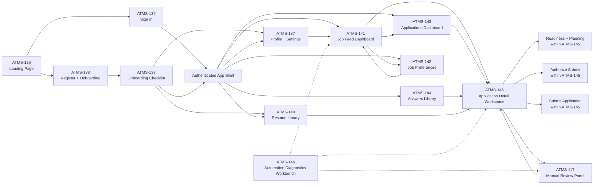

# Artemis Frontend Page Map

This document captures the current frontend information architecture derived from the ATMS-56 API/UI audit and the resulting Jira design tickets.

## Tickets Covered

- `ATMS-136` Landing page
- `ATMS-137` Candidate profile and account settings
- `ATMS-138` Registration and onboarding
- `ATMS-139` Sign in
- `ATMS-140` Resume library and upload management
- `ATMS-141` Job feed dashboard
- `ATMS-142` Job preferences and targeting settings
- `ATMS-143` Applications dashboard
- `ATMS-144` Reusable application answers library
- `ATMS-145` Application detail workspace
- `ATMS-146` Internal automation diagnostics workbench
- `ATMS-117` Manual fill review panel

## Mermaid Page Map



## Navigation Summary

### Public Entry

- `ATMS-136` -> `ATMS-139`
- `ATMS-136` -> `ATMS-138`

### Onboarding and Setup

- `ATMS-138` -> `ATMS-137`
- `ATMS-138` -> `ATMS-140`
- `ATMS-138` -> authenticated app shell

### Authenticated App Shell

- app shell -> `ATMS-141`
- app shell -> `ATMS-143`
- app shell -> `ATMS-144`
- app shell -> `ATMS-137`
- app shell -> `ATMS-140`
- app shell -> `ATMS-142`

### Main Product Flows

- `ATMS-141` -> `ATMS-142`
- `ATMS-141` -> `ATMS-143`
- `ATMS-141` -> `ATMS-145`
- `ATMS-143` -> `ATMS-145`
- `ATMS-144` -> `ATMS-145`
- `ATMS-140` -> `ATMS-145`
- `ATMS-137` -> `ATMS-141`
- `ATMS-142` -> `ATMS-141`

### Application Detail Subflows

- `ATMS-145` contains readiness, planning, automation run, authorization, and submit controls.
- `ATMS-145` can escalate to `ATMS-117` when unresolved fields require manual intervention.
- `ATMS-117` returns the user back to `ATMS-145` after review.

### Internal-Only Tooling

- `ATMS-146` is not part of the normal candidate navigation.
- `ATMS-146` exists to support internal debugging and QA around `ATMS-145`, `ATMS-117`, and related automation flows.

## Suggested IA Grouping

- Public entry: `ATMS-136`, `ATMS-138`, `ATMS-139`
- Setup/account: `ATMS-137`, `ATMS-140`
- Discovery: `ATMS-141`, `ATMS-142`
- Application workflow: `ATMS-143`, `ATMS-145`, `ATMS-144`, `ATMS-117`
- Internal tools: `ATMS-146`

## Figma Master Prompt

Use the following prompt when generating the Artemis product experience in Figma.

```text
Design a modern web application for Artemis, an AI-assisted job application copilot. The product helps candidates manage their job search, upload and parse resumes, discover jobs, create and track applications, reuse answers across applications, and safely automate parts of the application workflow.

I want the overall product to feel polished, modern, credible, and highly usable. The UI should not look like a generic template. It should feel like a thoughtful workflow product for ambitious job seekers. Prioritize clarity, confidence, speed, and trust.

Core product qualities:
- Clean and contemporary visual design
- Strong typography hierarchy
- Excellent spacing and layout rhythm
- Intuitive navigation
- Clear status communication
- Calm but premium visual tone
- Great UX for both first-time and returning users
- Modern SaaS/product design language without looking bland or overused
- Interfaces that feel operational and helpful, not cluttered

Important product principle:
Artemis does not blindly submit applications for the user. The product should visually communicate user control, safety, and transparency. Manual authorization before submission is an important concept and should be clearly represented in the application workflow.

Design system direction:
- Use a modern desktop-first web app approach with responsive mobile adaptations
- The visual style should feel refined and slightly premium
- Prefer subtle depth, strong card structure, clean dividers, excellent whitespace, and clear section grouping
- Use color intentionally for status, hierarchy, and trust
- Make the interface feel sophisticated but approachable
- Avoid overly playful startup illustrations unless they support clarity
- Avoid dark, noisy, hacker-style aesthetics
- Avoid generic purple-on-white AI startup styling
- Make the product feel reliable and serious enough for career decisions

Suggested visual tone:
- Light theme preferred
- Neutral base with a distinctive accent color system
- Clear semantic colors for success, warning, blocked, in-progress, ready, and submitted states
- Crisp dashboard surfaces and layered panels
- High readability for tables, cards, lists, and detailed workflows

Primary information architecture and page map:

1. Public entry
- Landing page
- Sign in page
- Registration and onboarding page

2. Setup and account
- Candidate profile and account settings
- Resume library and upload management

3. Discovery
- Job feed dashboard
- Job preferences and targeting settings

4. Application workflow
- Applications dashboard
- Reusable application answers library
- Application detail workspace
- Manual fill review panel

5. Internal-only tooling
- Automation diagnostics workbench

Navigation map:
- Landing page -> Sign in
- Landing page -> Register and onboarding
- Sign in -> Authenticated app shell
- Registration/onboarding -> Profile setup
- Registration/onboarding -> Resume upload
- Registration/onboarding -> Authenticated app shell
- Authenticated app shell -> Job feed dashboard
- Authenticated app shell -> Applications dashboard
- Authenticated app shell -> Reusable answers library
- Authenticated app shell -> Profile/settings
- Authenticated app shell -> Resume library
- Authenticated app shell -> Job preferences
- Job feed dashboard -> Job preferences
- Job feed dashboard -> Applications dashboard
- Job feed dashboard -> Application detail workspace
- Applications dashboard -> Application detail workspace
- Answers library -> Application detail workspace
- Resume library -> Application detail workspace
- Profile/settings -> Job feed dashboard
- Job preferences -> Job feed dashboard
- Application detail workspace -> Manual fill review panel when unresolved fields require human intervention
- Manual fill review panel -> back to application detail workspace
- Internal automation diagnostics workbench is separate from the normal candidate-facing navigation

Screens to design:

Landing page:
- Strong hero section with headline, subheadline, primary CTA, secondary CTA
- Explain the workflow: profile, resume, jobs, applications, readiness, automation, authorization, submission
- Show value props like resume parsing, reusable answers, job feed, application tracking, and human-controlled automation
- Include trust/safety messaging
- Make it feel modern, premium, and highly credible

Sign in page:
- Focused email/password form
- Clear states for loading, invalid credentials, rate limiting, and expired sessions
- Easy path to registration
- Compact, elegant, frictionless

Registration and onboarding:
- Registration form
- Immediate transition into onboarding checklist
- Guide user to complete profile and upload resume
- Make first-run setup feel easy and motivating, not overwhelming

Profile and account settings:
- Structured, easy-to-scan settings layout
- Separate personal info, professional links, preferences, and automation-related settings
- Make high-impact settings especially clear
- Explicit saved/unsaved/saving/error states

Resume library and upload management:
- Prominent upload area
- List of resumes
- Latest upload result summary
- Missing profile fields panel when parsing is incomplete
- Clear guidance on what to do next

Job feed dashboard:
- Desktop-first productivity layout
- Scan jobs action
- Filter/sort controls
- Feed cards or rows showing title, company, location, work mode, salary if available, and quick actions
- Save and dismiss actions should be fast and obvious
- Make it feel like a smart review workspace, not a generic list

Job preferences page:
- Simple, highly usable settings UI for role targeting, keywords, work mode, and compensation preferences
- Explain how preferences affect feed quality
- Keep it understandable for non-technical users

Applications dashboard:
- A control-tower view of all applications
- Distinguish lifecycle status from automation readiness
- Help users spot blocked or ready applications quickly
- Include status counts, filters, and CTA to create a new application

Reusable answers library:
- Feels like a personal knowledge base
- Good long-form text readability
- Users can create, browse, and review saved answers
- Include an area for testing how Artemis would resolve a raw question to a saved answer

Application detail workspace:
- This is the most important screen
- Include application summary header, lifecycle/status timeline, readiness blockers, planned answers preview, automation run actions, authorization step, and submit action
- Clearly show what state the application is in and what the next action should be
- Distinguish running automation from actually submitting the application
- Make blocked states, warnings, and failure states visually clear
- Show when manual authorization is required
- Show when the workflow escalates to manual review

Manual fill review panel:
- A focused review interface for unresolved fields
- Lets users inspect what still needs manual input or confirmation
- Should connect naturally back into the application detail workspace

Internal automation diagnostics workbench:
- Internal tool, not candidate-facing
- Dense information layout is acceptable
- Include raw inspection output, fill plan output, test-fill results, and debug-oriented panels
- This screen should clearly look internal and diagnostic

UX requirements across the whole product:
- Make the navigation structure easy to understand
- Reduce cognitive overload through progressive disclosure and clear grouping
- Use consistent page headers, panels, empty states, and call-to-action patterns
- Make status-driven workflows easy to scan
- Design for confidence: users should always know what happened, what state they are in, and what happens next
- Error states should be helpful and well designed
- Empty states should teach the next step
- Tables and dashboards should remain readable and elegant
- Detail pages should balance density with clarity
- Mobile layouts should preserve hierarchy and usability even if they are simplified versions of the desktop views

Output expectations:
- Create a cohesive multi-screen product flow
- Keep visual consistency across screens
- Use modern UX patterns and polished UI composition
- Make the app feel implementation-ready rather than conceptual
- The resulting product should look like a serious, modern career workflow platform with excellent user experience
```